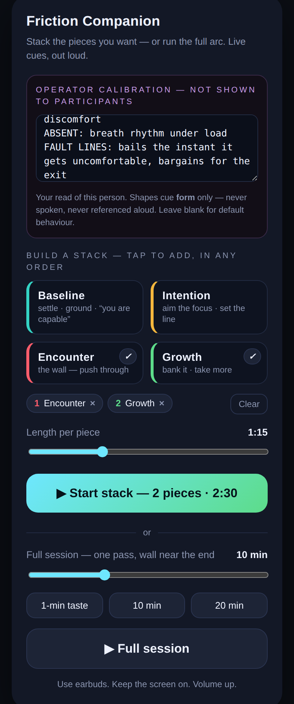

# Run the demo — step by step (no coding needed)

You'll run a small program on a computer, then open a page on your phone.
The phone plays the coaching cues out loud; the computer generates them live.

**You need:** a Mac or Windows computer · a phone · both on the **same Wi-Fi** · earbuds.
One-time setup is ~10 minutes. After that, starting the demo is one command.

---

## Part 1 — One-time setup

### 1. Install Node.js
Go to <https://nodejs.org> and download the **LTS** version. Install it like any app.

### 2. Get this project onto the computer
Easiest: download the ZIP of this branch —
<https://github.com/yywpoppy43/friction-companion/archive/refs/heads/claude/engine-workout-simulation-c2t4yb.zip>
— then double-click to unzip. You get a folder (name starts with `friction-companion`).

*(Alternative, if you use git: `git clone --branch claude/engine-workout-simulation-c2t4yb https://github.com/yywpoppy43/friction-companion.git`)*

### 3. Open a terminal in that folder
- **Mac:** press `Cmd+Space`, type `Terminal`, press Enter. Type `cd ` (with a space), **drag the unzipped folder onto the Terminal window**, press Enter.
- **Windows:** open the unzipped folder in File Explorer, click the address bar, type `powershell`, press Enter.

### 4. Create your API key
1. Go to <https://console.anthropic.com> and sign in.
2. In the left menu choose **API Keys** → **Create Key** → give it any name → **Copy** the key.
   It starts with `sk-ant-`. (Keep it private — treat it like a password.)

### 5. Put the key in a `.env` file
In the terminal you opened (replace with **your** key), copy-paste ONE of these:

**Mac:**
```bash
echo 'ANTHROPIC_API_KEY=sk-ant-PASTE-YOUR-KEY-HERE' > .env
```

**Windows (PowerShell):**
```powershell
'ANTHROPIC_API_KEY=sk-ant-PASTE-YOUR-KEY-HERE' | Out-File -Encoding ascii .env
```

That creates a file named exactly `.env` next to `package.json`, whose whole content is that one line. The server finds it by itself — you never have to "export" anything. The key stays on the computer; it is **never** sent to the phone/page.

---

## Part 2 — Start the demo (every time)

In the terminal, inside the project folder:

```bash
npm run serve:app
```

You'll see something like:

```
Friction Companion server listening on http://localhost:8787
  on your network:  http://192.168.1.23:8787   ← open this on your phone
✔ API key loaded — cues will be generated live.
```

- If it says `⚠ No API key found` — the `.env` file is missing or misnamed; redo Part 1 step 5, press `Ctrl+C`, run the command again.
- Keep this terminal window open while you demo. `Ctrl+C` stops the server.

**On your phone:** connect to the same Wi-Fi, open the **"on your network"** address in Safari (iPhone) or Chrome (Android). Earbuds in, volume up.

---

## Part 3 — Running people through it

**Build a stack (your main tool):** tap the stage cards — **Baseline, Intention, Encounter, Growth** — in any order, any number of times. Each tap queues one piece; the numbered chips show the running order (tap a chip to remove it). Set **Length per piece** (default 1:15). Tap **Start stack**. Each piece speaks its own live cue, then holds silently until the next one.

**Or the full arc:** pick a length and tap **Full session** — one pass with the wall (Encounter) landing near the end, like a real set.

**Safety — say this out loud before anyone starts, and mean it:** the cues are for *burn and shake* — the ordinary discomfort of effort — **never for pain**. If a participant feels **sharp pain, joint pain, dizziness, or numbness**, they stop immediately and reset; that overrides anything the voice says. The app is built the same way: if a cue is ever generated for a pain/dizziness situation, the only thing it will say is to stop and reset. You are the human in the room — if someone looks wrong, stop the session.

**Operator calibration (optional, advanced):** you can tune *how* the cues are worded to the specific person in front of you. Open the app with `?operator=1` on the end of the address (e.g. `http://192.168.1.23:8787/?operator=1`) — an **Operator calibration** box appears that participants never see on the plain address. Paste a short four-line read:

```
CORE: what this person runs on
STRONG: what they do well
ABSENT: the missing channel
FAULT LINES: where they bail / negotiate the exit
```

This shapes the *form* of the cues only (e.g. a "grinds through everything" person gets subtracting, slowing cues; a "no breath channel" person gets one move, not a sequence). The profile is **never spoken aloud and never referenced** — the app double-checks every line and rejects any that quotes it. Leave the box blank and the app behaves exactly as normal. Keep `?operator=1` to your own control device; open the plain address on the participant's phone.



**Reset for the next person (one tap):**
- When the screen says **DONE**, tap **“▶ Next person — run again”** — the exact same stack restarts immediately, with **freshly generated cues** (they will be worded differently each run).
- Want a different stack for the next person? Tap **Edit stack** — your queue is kept; adjust and Start.
- Need to bail mid-run? **Stop session** — back to the picker, queue kept.

---

## If something's off

| Symptom | Fix |
|---|---|
| Cues sound identical every run / feel canned | The key isn't loading. Check the file is named exactly `.env` (not `.env.txt`), contents `ANTHROPIC_API_KEY=sk-ant-...`, then restart the server. The server prints `✔ API key loaded` when it's right. |
| Phone can't open the page | Same Wi-Fi as the computer? On Mac, click **Allow** if a firewall prompt appears. Try the other printed address. Some guest/hotel Wi-Fi blocks phone↔laptop traffic — use a phone hotspot instead. |
| No sound on the phone | Volume up; make sure you tapped Start (the tap is what unlocks audio on iPhone); check earbuds are connected; Safari works best on iPhone. |
| Voice sounds robotic | That's the phone's built-in free voice — expected for now. |
| A stage says "server unreachable" | The computer's server stopped or Wi-Fi dropped; restart `npm run serve:app` and reload the page. |

---

## Optional — put the "it's really live" proof on record

One-time: `npm install`, then `npm i -D playwright` and `npx playwright install chromium`.
Then:

```bash
npm run verify:app
```

It runs two full sessions back-to-back and prints **Session 1 vs Session 2** cue wording. With your key in place, every stage's wording differs between the runs — that's the proof the cues are generated live, not played from a stored list. (It also re-checks: the key never appears in the page, the 10-minute spacing with the wall at ~86%, queued order, and that no cue ever talks over another.)
