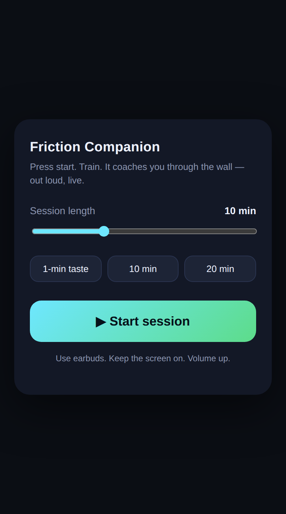
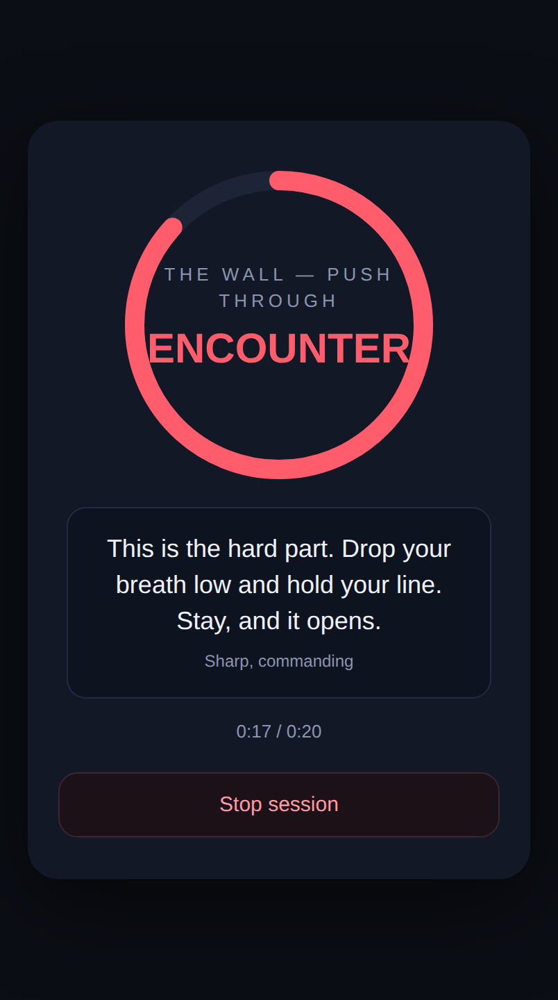

# Friction Companion — Stage-1 live app (press Start → hear live cues)

Tap **Start**, do your workout, and hear the engine coach you through the wall —
out loud, with **live-generated cues** and **real session timing**. It uses your
device's **built-in voice** (free, offline once loaded); the cue *text* is
generated fresh each session by the engine.

 

## Architecture (two parts)

```
  phone browser  ──POST /api/cue {stage}──▶  webapp/server.ts  ──▶  AnthropicCueGenerator
  (index.html)   ◀──── {cue text, tone} ────  (holds the key)        (the engine's live
   speaks it aloud, on real timing                                    generator)
```

- **`server.ts`** holds `ANTHROPIC_API_KEY` **server-side** and exposes
  `POST /api/cue` that runs the engine's real generator to produce one live,
  in-voice cue for a stage. The key is **never** sent to the browser. If
  generation fails (no key / flaky network) it returns the engine's hand-authored
  **safe-default** cue for that stage, so a stage is never silent.
- **`index.html`** bakes in **no cues at all**. On Start it fetches each stage's
  cue live from the server and speaks it. Stages run on the **true length** you
  pick — Baseline and Intention up front, a long silent "work" stretch, the
  **Encounter at the break** (~86% in), then Growth — and **no cue begins before
  the previous one finishes speaking**.

## Run it

Live cues need the key. Set `ANTHROPIC_API_KEY` (see the repo README, *Setting the
API key*), then from the repo root:

```bash
npm run serve:app          # prints a localhost URL and your LAN URL(s)
```

- **On this machine:** open the printed `http://localhost:8787`.
- **On your phone (same Wi-Fi):** open the printed `http://<your-LAN-ip>:8787`.
  Earbuds in, volume up, tap **Start** (the first tap unlocks the voice on iPhone).

Without a key the app still runs end-to-end, but every cue is the safe-default
line for its stage (identical each time) — set the key to hear live, varied cues.

> Open it **through the server URL**, not as a `file://` — the page calls the
> server for every cue.

## Verify it

```bash
npm run verify:app         # starts the server, drives two sessions in headless Chromium
```

Checks: no key material in the page; the 10-minute schedule spaces the four
stages with the Encounter near the break; two consecutive sessions run in
lifecycle order with **no overlapping speech**; and — when a key is present — the
two sessions' wording **differs** (proof of live generation, not a baked batch).
Requires Playwright (`npm i -D playwright && npx playwright install chromium`).

## What this MVP still isn't (Stage 2/3)

It fires on **time**, not on your heart rate; it uses the browser's built-in
voice, not a premium one; and it's one pass of the four stages, not a multi-round
loop. Those upgrades ride on seams the backend already has (biometric trigger,
swappable TTS, the relational cue matrix). See the project README.
